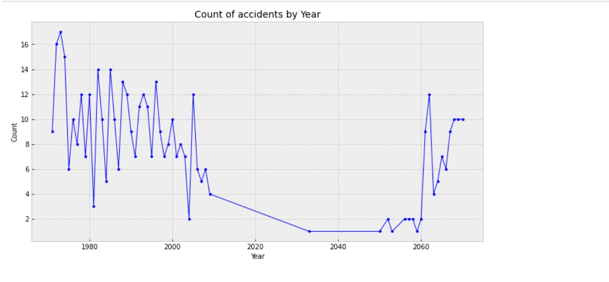

# Journey in save airplanes

## About Us
- Wahid Popal Ali Ahmad Popal
- Fardin Alam
- GetHub repository: CSCI-2000U-Final-Project-crashed-planes-analysis

## Introduction

Have you ever felt anxious before getting on a plane? Or have you ever worried about your safety while you were on a plane? The members here at group 6 would like to ease your worries. We decided to create a project that examines the crash records of passenger planes from 1933-2009 to determine which types of planes are the safest for your travels. 

Our topic is called Journey in safe airplanes, the dataset we used for this topic is called Large_Passenger_Plane_Crashes_1933_to_2009. This dataset was created by Juan C Ventosa but was derived from another dataset called AirplaneCrashesandFatalitiesSince_1908.csv made by Sauro Grandi. 

From this dataset we answer some of the following questions: Overall aboard and fatalities, which plane had the most crashes, which route has the most crashes and more.

## Discussion

Through out the process of analysing the dataset Large_Passenger_Plane_Crashes_1933_to_2009 We found many interesting facts that is not only shocking, but it can help you better understand your way in hundreds of different airlines for a saver and better journey. One of the most shocking finding of our dataset was the people dead on the ground. Around in 8/24/01 Boeing 767-223ER airplane on the journey from New York City to New York crash landed and almost killed 2750 people on ground.

There are many other planes crashes that killed hundreds of people on the ground. A year ago, in 2021 in Pakistan a plane crashes and killed many people on ground and bring a lot of distraction on ground properties.

Secondly, before analysing the data, we believed today’s world airplanes safety would disrupt Fatalities, but we still live-in dark ages for improving the safety and make better and sufficient airplanes. After we collected all the data, we saw that more than half aborded people died from the crash which is super disappointing and hurtful.

### Observations of fatalities per year chart:   
As you can see from the graph our overall boarded passengers on the crashed planes was 62589, and the fatalities 42119 which means that over 67% of people lost their lives on these doomed aircrafts. This is a number we are hoping decreases with time and more safety percautions

Last but not least, we also figured that we know less then what we should know about airplanes and how many crashes we have each year. Most importantly, people seem to care less on how each year the crashes going up. We need to have a system that would properly examine the failing for the planes and try to come up with a better and more secure solutions that would involve less people’s deaths and destruction on the ground.

### Observations on counts of accidents per year chart:
Since the aviation industry is always evolving, we would have anticipated and expected the number of accidents to plummet since we improved in other areas of technology so drastically, although overall trend is going down there are some years in the early 2000s where you can clearly see that the number of accidents are almost the same as some years in the 1980s.

In the 1980s the spike in accident really concerend us, but after doing further research we can make a hypothesis that since more people were flying more oftern, the number of accidents increased. More people flying = more flights = more potential plane crashes.

There ware many other instructing facts that did not only shocked us but awarded us why it is super important to pay more attention to the airplane’s safety and manufacturing and probably in future trying to prevent people from dying or even fever accidents.

## Conclusion

When it comes to the aviation industry, an industry where millions of people put their lives in the hands of these aircrafts. It's important for the mass population to feel safer when boarding these machines, as you can see from our dataset thousands of people lost their lives on these aircrafts and some plane crashes alone claimed thousands of lives. With our dataset not only can we show the general population which plane is safer, but our data can also show data scientists what things to take into consideration when creating autopilot software. From our past mistakes we can change our future and improve our technology so that we can save countless lives and make sure everyone returns to their families safe and sound.
