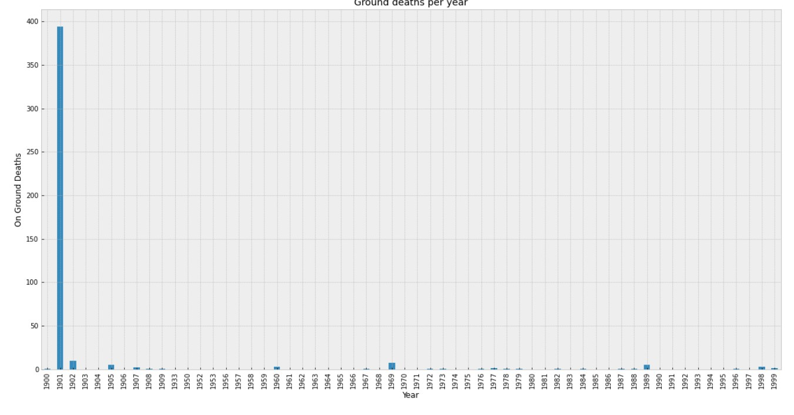
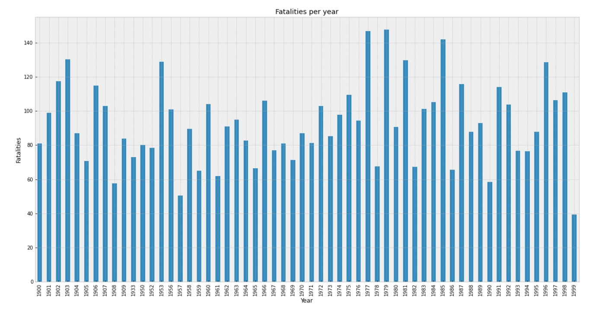

# Journey in save airplanes

## About Us
- Wahid Popal Ali Ahmad Popal
- Fardin Alam
- GetHub repository: CSCI-2000U-Final-Project-crashed-planes-analysis

## Introduction

Have you ever felt anxious before getting on a plane? Or have you ever worried about your safety while you were on a plane? The members here at group 6 would like to ease your worries. We decided to create a project that examines the crash records of passenger planes from 1933-2009 to determine which types of planes are the safest for your travels. 

Our topic is called Journey in safe airplanes, the dataset we used for this topic is called Large_Passenger_Plane_Crashes_1933_to_2009. This dataset was created by Juan C Ventosa but was derived from another dataset called AirplaneCrashesandFatalitiesSince_1908.csv made by Sauro Grandi. 

From this dataset we answer some of the following questions: Overall aboard and fatalities, which plane had the most crashes, which route has the most crashes and more.

## Discussion

Through out the process of analysing the dataset Large_Passenger_Plane_Crashes_1933_to_2009 We found many interesting facts that is not only shocking, but it can help you better understand your way in hundreds of different airlines for a saver and better journey. One of the most shocking finding of our dataset was the people dead on the ground. Around in 8/24/01 Boeing 767-223ER airplane on the journey from New York City to New York crash landed and almost killed 2750 people on ground.

There are many other planes crashes that killed hundreds of people on the ground. A year ago, in 2021 in Pakistan a plane crashes and killed many people on ground and bring a lot of distraction on ground properties.

Secondly, before analysing the data, we believed today’s world airplanes safety would disrupt Fatalities, but we still live-in dark ages for improving the safety and make better and sufficient airplanes. After we collected all the data, we saw that more than half aborded people died from the crash which is super disappointing and hurtful.

## Conclusion

your writing goes here...
